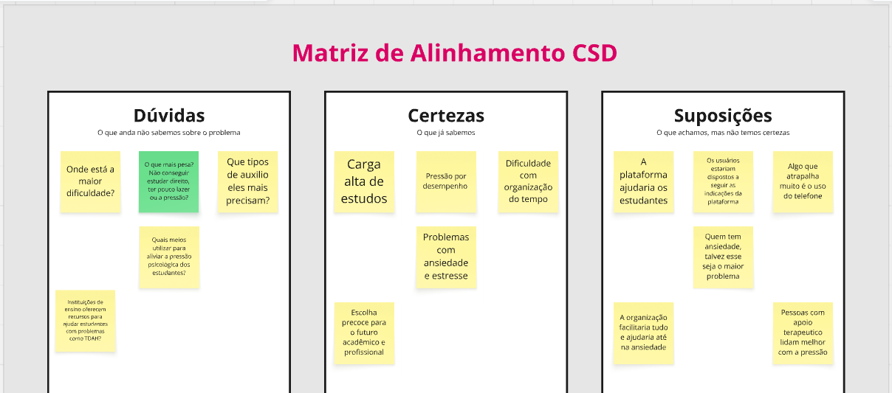
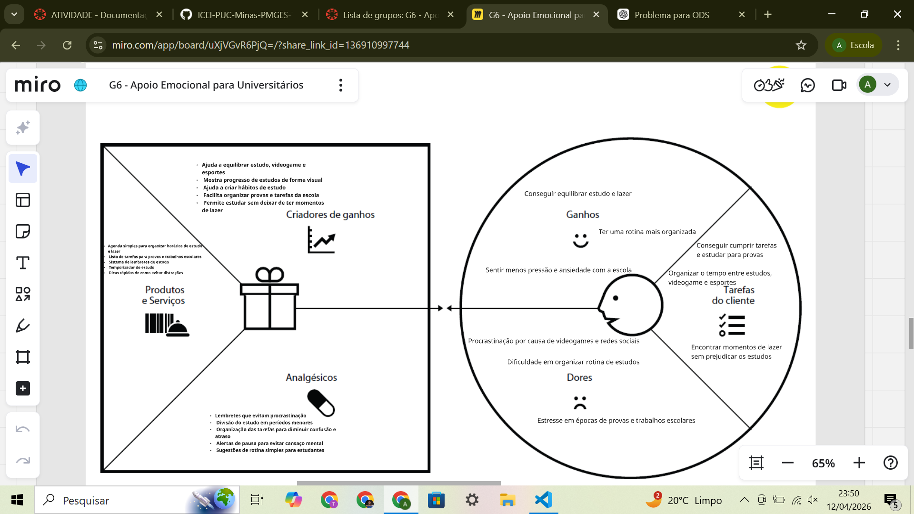
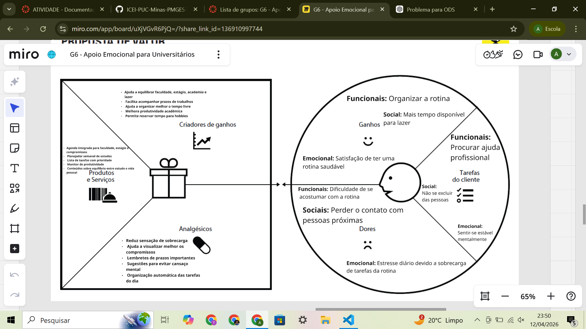
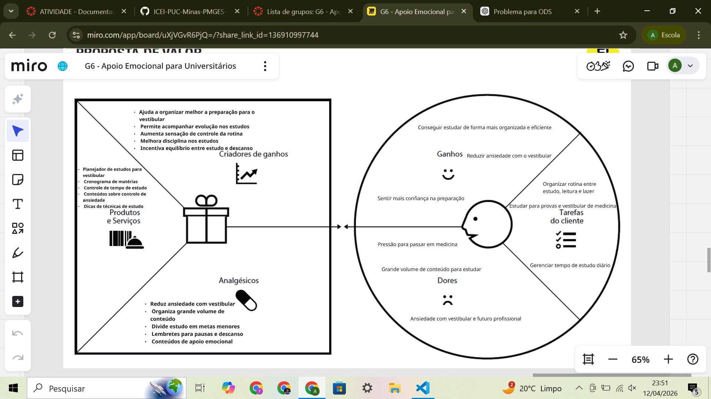
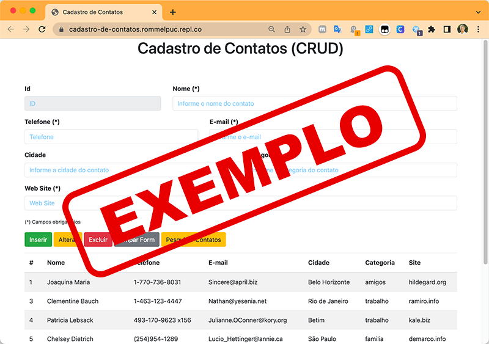

# Introdução

Informações básicas do projeto.

* **Projeto:** Plannit
* **Repositório GitHub:** https://github.com/ICEI-PUC-Minas-PMGES-TI/pmg-es-2026-1-ti1-0427200-plannit-1.git
* **Membros da equipe:**

  * [Antônio Cardoso](https://github.com/AntonioCardosoASimoes)
  * [Gabriel Cedric]() 
  * [Henrique Victor]()
  * [Ian Marco]()
  * [João Victor Martins]()
  * [Leonardo Gonzaga]() 

A documentação do projeto é estruturada da seguinte forma:

1. Introdução
2. Contexto
3. Product Discovery
4. Product Design
5. Metodologia
6. Solução
7. Referências Bibliográficas

✅ [Documentação de Design Thinking (MIRO)](https://miro.com/app/board/uXjVGvR6PjQ=/?share_link_id=136910997744)

# Contexto

Detalhes sobre o espaço de problema, os objetivos do projeto, sua justificativa e público-alvo.

## Problema

Estudantes do ensino médio e universitários têm dificuldade em equilibrar os estudos com a saúde mental. A grande quantidade de tarefas, provas e cobranças faz com que muitos se sintam estressados, ansiosos e sobrecarregados.

Além disso, muitos não conseguem organizar bem o próprio tempo, o que leva à procrastinação e ao acúmulo de atividades. Apesar de existirem algumas ferramentas de organização, a maioria não leva em conta o bem-estar do estudante, focando apenas na produtividade.

## Objetivos

OBJETIVO GERAL: Desenvolver uma aplicação web que ajude estudantes a organizarem seus estudos e, ao mesmo tempo, cuidarem da sua saúde mental.

OBJETIVOS ESPECÍFICOS: Ajudar na organização de tarefas e horários de estudo; Incentivar pausas e momentos de descanso; Oferecer conteúdos simples sobre bem-estar e produtividade; Facilitar o acompanhamento da rotina do estudante.

## Justificativa

Esse projeto foi escolhido porque muitos estudantes sofrem com estresse e ansiedade por causa dos estudos. Isso mostra que é importante ter uma ferramenta que ajude não só na organização, mas também no cuidado com a saúde mental.

Além disso, como os estudantes já usam bastante a internet e aplicativos, uma aplicação web pode ser uma solução prática e acessível para o dia a dia.

A ideia é criar uma ferramenta que una produtividade e bem-estar, ajudando o estudante a ter uma rotina mais equilibrada.

## Público-Alvo

O público-alvo são estudantes do ensino médio, de cursinho e universitários, geralmente entre 15 e 25 anos.

Eles já têm familiaridade com tecnologia, como celular, computador e aplicativos, e usam esses recursos com frequência. Porém, nem sempre conseguem utilizá-los para se organizar melhor.

Esses estudantes podem ter dificuldades com organização, falta de tempo e também lidar com estresse e ansiedade por causa dos estudos.

STAKEHOLDERS:
- FUNDAMENTAIS: Estudantes ensino médio, cursinho e faculdade
- IMPORTANTES: Terapeutas/Orientadores educacionais
- INFLUENCIADORES: Professores, instituições de ensino e diretores

# Product Discovery

## Etapa de Entendimento



## Etapa de Definição

### Personas

**PERSONA 1:**
- Nome: Marcos Pedro
- Idade: 17 anos
- Hobby: Videogames e esportes
- Trabalho: Estudante

- Personalidade:
Um jovem extrovertido, gosta de sair, jogar videogame e futebol com os amigos e não gosta muito de estudar.

- Sonhos:
Ser bem sucedido e dar melhores condições de vida para a família.

- Objetos e lugares:
Usa videogame em casa, telefone em todo lugar, notebook para escola.

- Objetivos chave:
O objetivo seria diminuir a pressão e o estresse e organizar bem seu tempo para conseguir se dedicar aos estudos e praticar seu lazer.

**PERSONA 2:**
- Nome: Daniel Lopes
- Idade: 20 anos
- Hobby: Academia, ouvir música e tocar violão
- Trabalho: Estagiário de jornalismo

- Personalidade:
Um jovem mais introvertido, escuta música o dia todo e gosta de encontrar os amigos.

- Sonhos:
Ser um bom e reconhecido jornalista e trabalhar numa emissora grande.

- Objetos e lugares:
Usa fone quase o tempo todo que está fora de casa escutando suas músicas, usa o telefone, toca violão em casa.

- Objetivos chave:
O objetivo seria organizar melhor sua rotina para encaixar estudo, trabalho, academia e um tempo para treinar violão.

**PERSONA 3:**
- Nome: Rafaela Alves
- Idade: 18 anos
- Hobby: Caminhar, mexer nas redes sociais e ler
- Trabalho: Estudante

- Personalidade:
Uma jovem extrovertida, amigável, gosta de conversar, ver curiosidades e atualizações do mundo da medicina e sair com os amigos.

- Sonhos:
Passar em medicina na federal e ser médica.

- Objetos e lugares:
Usa bastante o celular, principalmente nos momentos de lazer e enquanto está indo para a aula, lê livros também e usa óculos.

- Objetivos chave:
O objetivo seria para ajudar a aliviar a pressão da carga volumosa de estudos e provas e da pressão de passar na federal, além de conseguir organizar melhor sua rotina.

# Product Design

Nesse momento, vamos transformar os insights e validações obtidos em soluções tangíveis e utilizáveis. Essa fase envolve a definição de uma proposta de valor, detalhando a prioridade de cada ideia e a consequente criação de wireframes, mockups e protótipos de alta fidelidade, que detalham a interface e a experiência do usuário.

## Histórias de Usuários

Com base na análise das personas foram identificadas as seguintes histórias de usuários:

| EU COMO...              | QUERO/PRECISO...                               | PARA...                                                    |
| ----------------------- | ---------------------------------------------- | ---------------------------------------------------------- |
| Estudante               | Um calendário/agenda                           | Organizar meus compromissos diários                        |
| Estudante               | Ajuda psicológica ou psicopedagógica           | Aliviar a tensão e o estresse diário                       |
| Estudante               | Uma maneira de comunicar com outros estudantes | Dar dicas de estudo e organização                          |
| Psicólogo/Psicopedagogo | Oferecer meu serviço                           | Ajudar os estudantes                                       |
| Estudante               | Conteúdos                                      | Me ajudar com procrastinação e ansiedade com provas        |
| Estudante               | Uma lista de tarefas                           | Ter controle do que já fiz e o que ainda precisa ser feito |


## Proposta de Valor





## Requisitos

As tabelas que se seguem apresentam os requisitos funcionais e não funcionais que detalham o escopo do projeto.

### Requisitos Funcionais

| ID     | Descrição do Requisito                                   | Prioridade |
| ------ | ---------------------------------------------------------- | ---------- |
| RF-001 | Permitir que o usuário cadastre tarefas ⚠️ EXEMPLO ⚠️ | ALTA       |
| RF-002 | Emitir um relatório de tarefas no mês ⚠️ EXEMPLO ⚠️ | MÉDIA     |

### Requisitos não Funcionais

| ID      | Descrição do Requisito                                                              | Prioridade |
| ------- | ------------------------------------------------------------------------------------- | ---------- |
| RNF-001 | O sistema deve ser responsivo para rodar em um dispositivos móvel ⚠️ EXEMPLO ⚠️ | MÉDIA     |
| RNF-002 | Deve processar requisições do usuário em no máximo 3s ⚠️ EXEMPLO ⚠️          | BAIXA      |

> ⚠️ **APAGUE ESSA PARTE ANTES DE ENTREGAR SEU TRABALHO**
>
> Os requisitos de um projeto são classificados em dois grupos:
>
> - [Requisitos Funcionais (RF)](https://pt.wikipedia.org/wiki/Requisito_funcional):
>   correspondem a uma funcionalidade que deve estar presente na plataforma (ex: cadastro de usuário).
> - [Requisitos Não Funcionais (RNF)](https://pt.wikipedia.org/wiki/Requisito_n%C3%A3o_funcional):
>   correspondem a uma característica técnica, seja de usabilidade, desempenho, confiabilidade, segurança ou outro (ex: suporte a dispositivos iOS e Android).
>
> Lembre-se que cada requisito deve corresponder à uma e somente uma característica alvo da sua solução. Além disso, certifique-se de que todos os aspectos capturados nas Histórias de Usuário foram cobertos.
>
> **Orientações**:
>
> - [O que são Requisitos Funcionais e Requisitos Não Funcionais?](https://codificar.com.br/requisitos-funcionais-nao-funcionais/)
> - [O que são requisitos funcionais e requisitos não funcionais?](https://analisederequisitos.com.br/requisitos-funcionais-e-requisitos-nao-funcionais-o-que-sao/)

## Projeto de Interface

Artefatos relacionados com a interface e a interacão do usuário na proposta de solução.

### Wireframes

Estes são os protótipos de telas do sistema.

**✳️✳️✳️ COLOQUE AQUI OS PROTÓTIPOS DE TELAS COM TÍTULO E DESCRIÇÃO ✳️✳️✳️**

##### TELA XPTO ⚠️ EXEMPLO ⚠️

Descrição para a tela XPTO


> ⚠️ **APAGUE ESSA PARTE ANTES DE ENTREGAR SEU TRABALHO**
>
> Wireframes são protótipos das telas da aplicação usados em design de interface para sugerir a estrutura de um site web e seu relacionamentos entre suas páginas. Um wireframe web é uma ilustração semelhante ao layout de elementos fundamentais na interface.
>
> **Orientações**:
>
> - [Ferramentas de Wireframes](https://rockcontent.com/blog/wireframes/)
> - [Figma](https://www.figma.com/)
> - [Adobe XD](https://www.adobe.com/br/products/xd.html#scroll)
> - [MarvelApp](https://marvelapp.com/developers/documentation/tutorials/)

### User Flow

**✳️✳️✳️ COLOQUE AQUI O DIAGRAMA DE FLUXO DE TELAS ✳️✳️✳️**


> ⚠️ **APAGUE ESSA PARTE ANTES DE ENTREGAR SEU TRABALHO**
>
> Fluxo de usuário (User Flow) é uma técnica que permite ao desenvolvedor mapear todo fluxo de telas do site ou app. Essa técnica funciona para alinhar os caminhos e as possíveis ações que o usuário pode fazer junto com os membros de sua equipe.
>
> **Orientações**:
>
> - [User Flow: O Quê É e Como Fazer?](https://medium.com/7bits/fluxo-de-usu%C3%A1rio-user-flow-o-que-%C3%A9-como-fazer-79d965872534)
> - [User Flow vs Site Maps](http://designr.com.br/sitemap-e-user-flow-quais-as-diferencas-e-quando-usar-cada-um/)
> - [Top 25 User Flow Tools &amp; Templates for Smooth](https://www.mockplus.com/blog/post/user-flow-tools)

### Protótipo Interativo

**✳️✳️✳️ COLOQUE AQUI UM IFRAME COM SEU PROTÓTIPO INTERATIVO ✳️✳️✳️**

✅ [Protótipo Interativo (MarvelApp)](https://marvelapp.com/prototype/4hd6091?emb=1&iosapp=false&frameless=false)  ⚠️ EXEMPLO ⚠️

> ⚠️ **APAGUE ESSA PARTE ANTES DE ENTREGAR SEU TRABALHO**
>
> Um protótipo interativo apresenta o projeto de interfaces e permite ao usuário navegar pelas funcionalidades como se estivesse lidando com o software pronto. Utilize as mesmas ferramentas de construção de wireframes para montagem do seu protótipo interativo. Inclua o link para o protótipo interativo do projeto.

# Metodologia

Detalhes sobre a organização do grupo e o ferramental empregado.

## Ferramentas

Relação de ferramentas empregadas pelo grupo durante o projeto.

| Ambiente                    | Plataforma | Link de acesso                                     |
| --------------------------- | ---------- | -------------------------------------------------- |
| Processo de Design Thinking | Miro       | https://miro.com/XXXXXXX ⚠️ EXEMPLO ⚠️        |
| Repositório de código     | GitHub     | https://github.com/XXXXXXX ⚠️ EXEMPLO ⚠️      |
| Hospedagem do site          | Render     | https://site.render.com/XXXXXXX ⚠️ EXEMPLO ⚠️ |
| Protótipo Interativo       | MarvelApp  | https://marvelapp.com/XXXXXXX ⚠️ EXEMPLO ⚠️   |
|                             |            |                                                    |

> ⚠️ **APAGUE ESSA PARTE ANTES DE ENTREGAR SEU TRABALHO**
>
> Liste as ferramentas empregadas no desenvolvimento do projeto, justificando a escolha delas, sempre que possível. Inclua itens como: (1) Editor de código, (2) )ferramentas de comunicação, (3) )ferramentas de diagramação, (4) )plataformas de hospedagem, entre outras.

## Gerenciamento do Projeto

Divisão de papéis no grupo e apresentação da estrutura da ferramenta de controle de tarefas (Kanban).


> ⚠️ **APAGUE ESSA PARTE ANTES DE ENTREGAR SEU TRABALHO**
>
> Nesta parte do documento, você deve apresentar  o processo de trabalho baseado nas metodologias ágeis, a divisão de papéis e tarefas, as ferramentas empregadas e como foi realizada a gestão de configuração do projeto via GitHub.
>
> Coloque detalhes sobre o processo de Design Thinking e a implementação do Framework Scrum seguido pelo grupo. O grupo poderá fazer uso de ferramentas on-line para acompanhar o andamento do projeto, a execução das tarefas e o status de desenvolvimento da solução.
>
> **Orientações**:
>
> - [Sobre Projects - GitHub Docs](https://docs.github.com/pt/issues/planning-and-tracking-with-projects/learning-about-projects/about-projects)
> - [Gestão de projetos com GitHub | balta.io](https://balta.io/blog/gestao-de-projetos-com-github)
> - [(460) GitHub Projects - YouTube](https://www.youtube.com/playlist?list=PLiO7XHcmTsldZR93nkTFmmWbCEVF_8F5H)
> - [11 Passos Essenciais para Implantar Scrum no seu Projeto](https://mindmaster.com.br/scrum-11-passos/)
> - [Scrum em 9 minutos](https://www.youtube.com/watch?v=XfvQWnRgxG0)

# Solução Implementada

Esta seção apresenta todos os detalhes da solução criada no projeto.

## Vídeo do Projeto

O vídeo a seguir traz uma apresentação do problema que a equipe está tratando e a proposta de solução. ⚠️ EXEMPLO ⚠️

[](https://www.youtube.com/embed/70gGoFyGeqQ)

> ⚠️ **APAGUE ESSA PARTE ANTES DE ENTREGAR SEU TRABALHO**
>
> O video de apresentação é voltado para que o público externo possa conhecer a solução. O formato é livre, sendo importante que seja apresentado o problema e a solução numa linguagem descomplicada e direta.
>
> Inclua um link para o vídeo do projeto.

## Funcionalidades

Esta seção apresenta as funcionalidades da solução.Info

##### Funcionalidade 1 - Cadastro de Contatos ⚠️ EXEMPLO ⚠️

Permite a inclusão, leitura, alteração e exclusão de contatos para o sistema

* **Estrutura de dados:** [Contatos](#ti_ed_contatos)
* **Instruções de acesso:**
  * Abra o site e efetue o login
  * Acesse o menu principal e escolha a opção Cadastros
  * Em seguida, escolha a opção Contatos
* **Tela da funcionalidade**:



> ⚠️ **APAGUE ESSA PARTE ANTES DE ENTREGAR SEU TRABALHO**
>
> Apresente cada uma das funcionalidades que a aplicação fornece tanto para os usuários quanto aos administradores da solução.
>
> Inclua, para cada funcionalidade, itens como: (1) titulos e descrição da funcionalidade; (2) Estrutura de dados associada; (3) o detalhe sobre as instruções de acesso e uso.

## Estruturas de Dados

Descrição das estruturas de dados utilizadas na solução com exemplos no formato JSON.Info

##### Estrutura de Dados - Contatos   ⚠️ EXEMPLO ⚠️

Contatos da aplicação

```json
  {
    "id": 1,
    "nome": "Leanne Graham",
    "cidade": "Belo Horizonte",
    "categoria": "amigos",
    "email": "Sincere@april.biz",
    "telefone": "1-770-736-8031",
    "website": "hildegard.org"
  }
  
```

##### Estrutura de Dados - Usuários  ⚠️ EXEMPLO ⚠️

Registro dos usuários do sistema utilizados para login e para o perfil do sistema

```json
  {
    id: "eed55b91-45be-4f2c-81bc-7686135503f9",
    email: "admin@abc.com",
    id: "eed55b91-45be-4f2c-81bc-7686135503f9",
    login: "admin",
    nome: "Administrador do Sistema",
    senha: "123"
  }
```

> ⚠️ **APAGUE ESSA PARTE ANTES DE ENTREGAR SEU TRABALHO**
>
> Apresente as estruturas de dados utilizadas na solução tanto para dados utilizados na essência da aplicação quanto outras estruturas que foram criadas para algum tipo de configuração
>
> Nomeie a estrutura, coloque uma descrição sucinta e apresente um exemplo em formato JSON.
>
> **Orientações:**
>
> * [JSON Introduction](https://www.w3schools.com/js/js_json_intro.asp)
> * [Trabalhando com JSON - Aprendendo desenvolvimento web | MDN](https://developer.mozilla.org/pt-BR/docs/Learn/JavaScript/Objects/JSON)

## Módulos e APIs

Esta seção apresenta os módulos e APIs utilizados na solução

**Images**:

* Unsplash - [https://unsplash.com/](https://unsplash.com/) ⚠️ EXEMPLO ⚠️

**Fonts:**

* Icons Font Face - [https://fontawesome.com/](https://fontawesome.com/) ⚠️ EXEMPLO ⚠️

**Scripts:**

* jQuery - [http://www.jquery.com/](http://www.jquery.com/) ⚠️ EXEMPLO ⚠️
* Bootstrap 4 - [http://getbootstrap.com/](http://getbootstrap.com/) ⚠️ EXEMPLO ⚠️

> ⚠️ **APAGUE ESSA PARTE ANTES DE ENTREGAR SEU TRABALHO**
>
> Apresente os módulos e APIs utilizados no desenvolvimento da solução. Inclua itens como: (1) Frameworks, bibliotecas, módulos, etc. utilizados no desenvolvimento da solução; (2) APIs utilizadas para acesso a dados, serviços, etc.

# Referências

As referências utilizadas no trabalho foram:

* SOBRENOME, Nome do autor. Título da obra. 8. ed. Cidade: Editora, 2000. 287 p ⚠️ EXEMPLO ⚠️

> ⚠️ **APAGUE ESSA PARTE ANTES DE ENTREGAR SEU TRABALHO**
>
> Inclua todas as referências (livros, artigos, sites, etc) utilizados no desenvolvimento do trabalho.
>
> **Orientações**:
>
> - [Formato ABNT](https://www.normastecnicas.com/abnt/trabalhos-academicos/referencias/)
> - [Referências Bibliográficas da ABNT](https://comunidade.rockcontent.com/referencia-bibliografica-abnt/)
