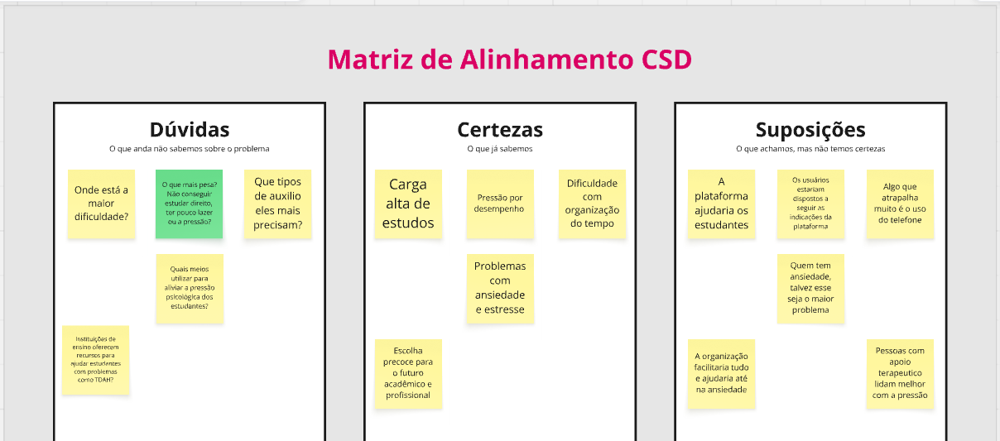
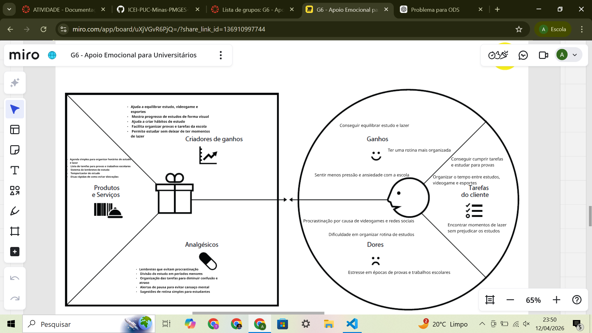
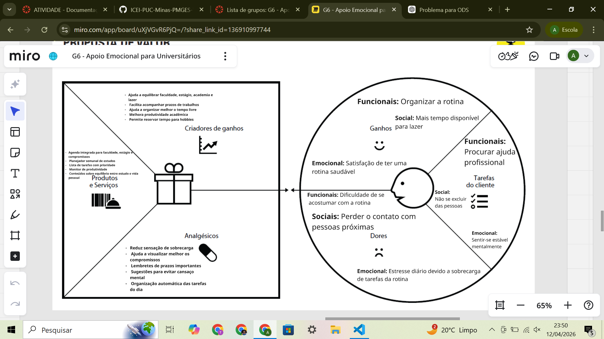
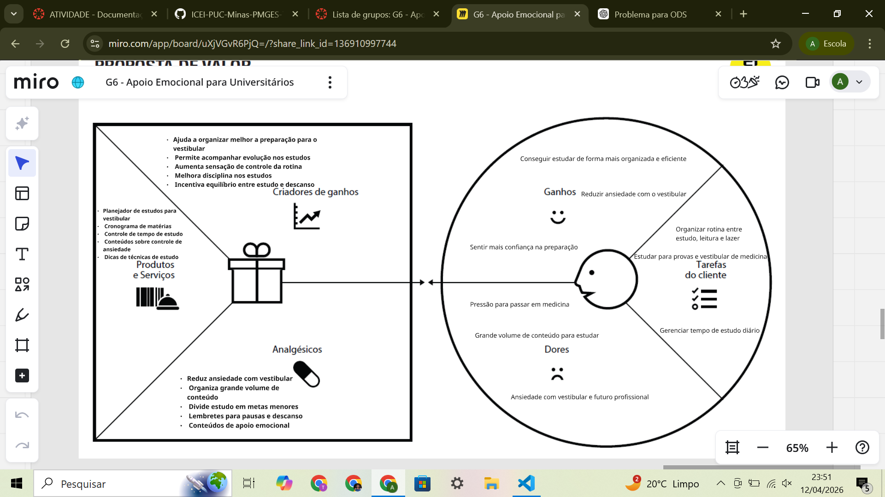
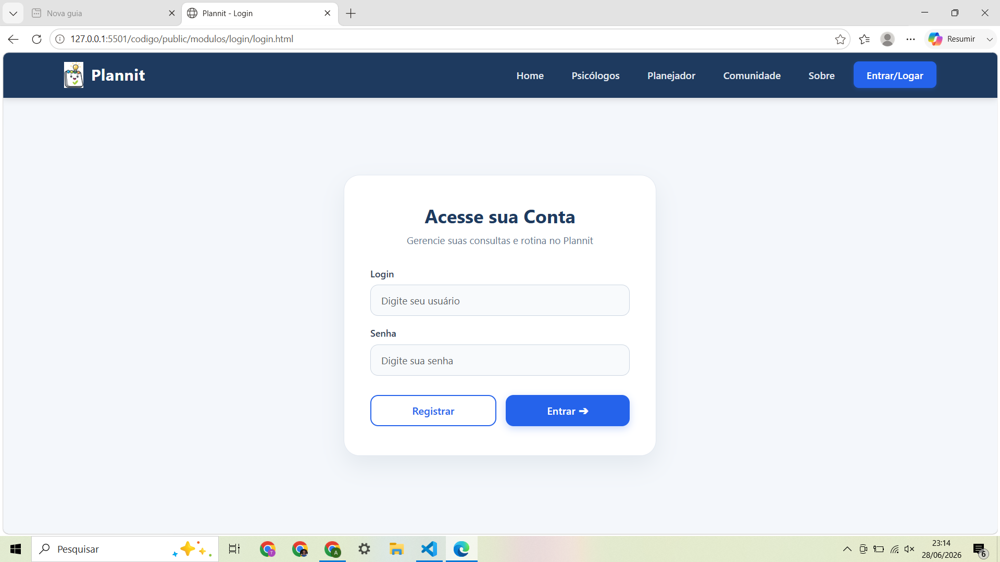
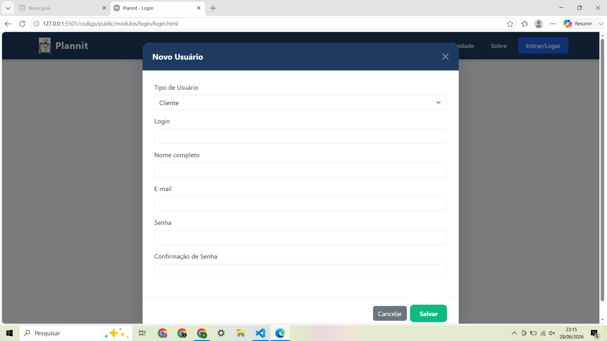

# Introdução

Informações básicas do projeto.

* **Projeto:** Plannit
* **Repositório GitHub:** https://github.com/ICEI-PUC-Minas-PMGES-TI/pmg-es-2026-1-ti1-0427200-plannit-1.git
* **Membros da equipe:**

  * [Antônio Cardoso](https://github.com/AntonioCardosoASimoes)
  * [Gabriel Cedric]() 
  * [Ian Marco]()
  * [Leonardo Gonzaga]() 

A documentação do projeto é estruturada da seguinte forma:

1. Introdução
2. Contexto
3. Product Discovery
4. Product Design
5. Metodologia
6. Solução
7. Referências Bibliográficas

✅ [Documentação de Design Thinking (MIRO)](https://miro.com/app/board/uXjVGvR6PjQ=/?share_link_id=136910997744)

# Contexto

Detalhes sobre o espaço de problema, os objetivos do projeto, sua justificativa e público-alvo.

## Problema

Estudantes do ensino médio e universitários têm dificuldade em equilibrar os estudos com a saúde mental. A grande quantidade de tarefas, provas e cobranças faz com que muitos se sintam estressados, ansiosos e sobrecarregados.

Além disso, muitos não conseguem organizar bem o próprio tempo, o que leva à procrastinação e ao acúmulo de atividades. Apesar de existirem algumas ferramentas de organização, a maioria não leva em conta o bem-estar do estudante, focando apenas na produtividade.

## Objetivos

OBJETIVO GERAL: Desenvolver uma aplicação web que ajude estudantes a organizarem seus estudos e, ao mesmo tempo, cuidarem da sua saúde mental.

OBJETIVOS ESPECÍFICOS: Ajudar na organização de tarefas e horários de estudo; Incentivar pausas e momentos de descanso; Oferecer conteúdos simples sobre bem-estar e produtividade; Facilitar o acompanhamento da rotina do estudante.

## Justificativa

Esse projeto foi escolhido porque muitos estudantes sofrem com estresse e ansiedade por causa dos estudos. Isso mostra que é importante ter uma ferramenta que ajude não só na organização, mas também no cuidado com a saúde mental.

Além disso, como os estudantes já usam bastante a internet e aplicativos, uma aplicação web pode ser uma solução prática e acessível para o dia a dia.

A ideia é criar uma ferramenta que una produtividade e bem-estar, ajudando o estudante a ter uma rotina mais equilibrada.

## Público-Alvo

O público-alvo são estudantes do ensino médio, de cursinho e universitários, geralmente entre 15 e 25 anos.

Eles já têm familiaridade com tecnologia, como celular, computador e aplicativos, e usam esses recursos com frequência. Porém, nem sempre conseguem utilizá-los para se organizar melhor.

Esses estudantes podem ter dificuldades com organização, falta de tempo e também lidar com estresse e ansiedade por causa dos estudos.

STAKEHOLDERS:
- FUNDAMENTAIS: Estudantes ensino médio, cursinho e faculdade
- IMPORTANTES: Terapeutas/Orientadores educacionais
- INFLUENCIADORES: Professores, instituições de ensino e diretores

# Product Discovery

## Etapa de Entendimento



## Etapa de Definição

### Personas

**PERSONA 1:**
- Nome: Marcos Pedro
- Idade: 17 anos
- Hobby: Videogames e esportes
- Trabalho: Estudante

- Personalidade:
Um jovem extrovertido, gosta de sair, jogar videogame e futebol com os amigos e não gosta muito de estudar.

- Sonhos:
Ser bem sucedido e dar melhores condições de vida para a família.

- Objetos e lugares:
Usa videogame em casa, telefone em todo lugar, notebook para escola.

- Objetivos chave:
O objetivo seria diminuir a pressão e o estresse e organizar bem seu tempo para conseguir se dedicar aos estudos e praticar seu lazer.

**PERSONA 2:**
- Nome: Daniel Lopes
- Idade: 20 anos
- Hobby: Academia, ouvir música e tocar violão
- Trabalho: Estagiário de jornalismo

- Personalidade:
Um jovem mais introvertido, escuta música o dia todo e gosta de encontrar os amigos.

- Sonhos:
Ser um bom e reconhecido jornalista e trabalhar numa emissora grande.

- Objetos e lugares:
Usa fone quase o tempo todo que está fora de casa escutando suas músicas, usa o telefone, toca violão em casa.

- Objetivos chave:
O objetivo seria organizar melhor sua rotina para encaixar estudo, trabalho, academia e um tempo para treinar violão.

**PERSONA 3:**
- Nome: Rafaela Alves
- Idade: 18 anos
- Hobby: Caminhar, mexer nas redes sociais e ler
- Trabalho: Estudante

- Personalidade:
Uma jovem extrovertida, amigável, gosta de conversar, ver curiosidades e atualizações do mundo da medicina e sair com os amigos.

- Sonhos:
Passar em medicina na federal e ser médica.

- Objetos e lugares:
Usa bastante o celular, principalmente nos momentos de lazer e enquanto está indo para a aula, lê livros também e usa óculos.

- Objetivos chave:
O objetivo seria para ajudar a aliviar a pressão da carga volumosa de estudos e provas e da pressão de passar na federal, além de conseguir organizar melhor sua rotina.

# Product Design

Nesse momento, vamos transformar os insights e validações obtidos em soluções tangíveis e utilizáveis. Essa fase envolve a definição de uma proposta de valor, detalhando a prioridade de cada ideia e a consequente criação de wireframes, mockups e protótipos de alta fidelidade, que detalham a interface e a experiência do usuário.

## Histórias de Usuários

Com base na análise das personas foram identificadas as seguintes histórias de usuários:

| EU COMO...              | QUERO/PRECISO...                               | PARA...                                                    |
| ----------------------- | ---------------------------------------------- | ---------------------------------------------------------- |
| Estudante               | Um calendário/agenda                           | Organizar meus compromissos diários                        |
| Estudante               | Ajuda psicológica ou psicopedagógica           | Aliviar a tensão e o estresse diário                       |
| Estudante               | Uma maneira de comunicar com outros estudantes | Dar dicas de estudo e organização                          |
| Psicólogo/Psicopedagogo | Oferecer meu serviço                           | Ajudar os estudantes                                       |
| Estudante               | Conteúdos                                      | Me ajudar com procrastinação e ansiedade com provas        |
| Estudante               | Uma lista de tarefas                           | Ter controle do que já fiz e o que ainda precisa ser feito |


## Proposta de Valor





## Requisitos

As tabelas que se seguem apresentam os requisitos funcionais e não funcionais que detalham o escopo do projeto.

### Requisitos Funcionais

| ID     | Descrição do Requisito                                                               | Prioridade |
| ------ | ------------------------------------------------------------------------------------ | ---------- |
| RF-001 | Permitir que o usuário crie uma conta no sistema                                     | ALTA       |
| RF-002 | Permitir que o usuário faça login no sistema                                         | ALTA       |
| RF-003 | Permitir que o usuário cadastre, edite e exclua tarefas                              | ALTA       |
| RF-004 | Permitir que o usuário visualize suas tarefas em formato de lista                    | ALTA       |
| RF-005 | Permitir que o usuário organize tarefas em um calendário/agenda                      | ALTA       |
| RF-006 | Enviar lembretes de tarefas e prazos ao usuário                                      | MÉDIA      |
| RF-007 | Exibir mensagens de lembrete para pausas durante o estudo                            | MÉDIA      |
| RF-008 | Disponibilizar conteúdos sobre bem-estar e produtividade                             | MÉDIA      |
| RF-009 | Permitir que o usuário acompanhe seu progresso (tarefas concluídas, horas de estudo) | MÉDIA      |
| RF-010 | Permitir que o usuário configure preferências (horários, pausas, notificações)       | BAIXA      |


### Requisitos não Funcionais

| ID      | Descrição do Requisito                                                                | Prioridade |
| ------- | ------------------------------------------------------------------------------------- | ---------- |
| RNF-001 | O sistema deve ser responsivo e funcionar em dispositivos móveis e desktops           | ALTA       |
| RNF-002 | O sistema deve ter interface simples e fácil de usar                                  | ALTA       |
| RNF-003 | O sistema deve carregar as páginas em no máximo 3 segundos                            | MÉDIA      |
| RNF-004 | O sistema deve garantir a segurança dos dados do usuário (login e senha)              | ALTA       |
| RNF-005 | O sistema deve estar disponível 24 horas por dia                                      | MÉDIA      |
| RNF-006 | O sistema deve permitir fácil manutenção e atualização                                | BAIXA      |
| RNF-007 | O sistema deve ter compatibilidade com os principais navegadores (Chrome, Edge, etc.) | MÉDIA      |


# Metodologia

Detalhes sobre a organização do grupo e o ferramental empregado.

## Ferramentas

Relação de ferramentas empregadas pelo grupo durante o projeto.

| Ambiente                    | Plataforma | Link de acesso                                     |
| --------------------------- | ---------- | -------------------------------------------------- |
| Processo de Design Thinking | Miro       | https://miro.com/app/board/uXjVGvR6PjQ=/?share_link_id=136910997744        |
| Repositório de código       | GitHub     | https://github.com/ICEI-PUC-Minas-PMGES-TI/pmg-es-2026-1-ti1-0427200-plannit-1.git      |
| Hospedagem do site          |      |  |
| Protótipo Interativo        |  |    |
| Wireframe                   | Canva      | https://canva.link/07ofo16qk1kvwy9                 |


## Gerenciamento do Projeto

Divisão de papéis no grupo e apresentação da estrutura da ferramenta de controle de tarefas (Kanban).


# Solução Implementada

Esta seção apresenta todos os detalhes da solução criada no projeto.

## Vídeo do Projeto

O vídeo a seguir traz uma apresentação do problema que a equipe está tratando e a proposta de solução. ⚠️ EXEMPLO ⚠️


## Funcionalidades

Esta seção apresenta as funcionalidades da solução.Info

##### Funcionalidade 1 - Login e cadastro do usuário

Permite a criação de um login para poder utilizar o site
* **Instruções de acesso:**
  * Abra o site e vá na opção de "Entrar/Logar" no canto superior direito
  * Se tiver uma conta faça o logim
  * Caso contrário, crie sua conta
* **Tela da funcionalidade**:




##### Funcionalidade 2 - Agendar consulta com psicólogos

Permite agendamento de consultas

* **Instruções de acesso:**
  * Na página principal vá em Acessar Consultas ou em Psicólogos no menu da página
  * Lá você conseguirá ver os psicólogos disponíveis e agendar uma consulta

##### Funcionalidade 3 - Organizar a rotina

Permite que o estudande planeje melhor suas tarefas diárias

* **Instruções de acesso:**
  * Na página principal vá em Abrir Planejador ou em Planejador no menu da página
  * Lá você conseguirá organizar sua rotina com as tarefas diárias necessárias

## Estruturas de Dados

Descrição das estruturas de dados utilizadas na solução com exemplos no formato JSON.Info

##### Estrutura de Dados

```json
  {
  "users": [
    {
      "login": "Leo",
      "senha": "Leo",
      "nome": "Leo",
      "email": "Leo",
      "tipo": "cliente",
      "id": "KhoW7jET6z0"
    },
    {
      "login": "Caio",
      "senha": "Caio",
      "nome": "Caio",
      "email": "Caio",
      "tipo": "psicologo",
      "psicologoId": "nGyAsWyEm54",
      "id": "cSLyPI7v3s0"
    }
  ],
  "psicologos": [
    {
      "crp": "04/1234",
      "especialidade": "Ansiedade",
      "cidade": "Belo Horizonte",
      "tipoAtendimento": "Ambos",
      "telefone": "31983620578",
      "valor": 120,
      "duracao": 50,
      "descricao": "Psicólogo clínico.",
      "id": "nGyAsWyEm54",
      "userId": "cSLyPI7v3s0"
    }
  ],
  "solicitacoes": [
    {
      "clienteId": "KhoW7jET6z0",
      "clienteNome": "Leo",
      "psicologoId": "nGyAsWyEm54",
      "psicologoNome": "Caio",
      "data": "2026-06-28",
      "horario": "08:00",
      "status": "cancelada",
      "id": "k2uqk8byuSM"
    }
  ],
  "agenda": [],
  "$schema": "./node_modules/json-server/schema.json"
}
  
```


## Módulos e APIs

Esta seção apresenta os módulos e APIs utilizados na solução

**Images**:

* Unsplash - [https://unsplash.com/](https://unsplash.com/) ⚠️ EXEMPLO ⚠️

**Fonts:**

* Icons Font Face - [https://fontawesome.com/](https://fontawesome.com/) ⚠️ EXEMPLO ⚠️

**Scripts:**

* jQuery - [http://www.jquery.com/](http://www.jquery.com/) ⚠️ EXEMPLO ⚠️
* Bootstrap 4 - [http://getbootstrap.com/](http://getbootstrap.com/) ⚠️ EXEMPLO ⚠️


# Referências

As referências utilizadas no trabalho foram:


